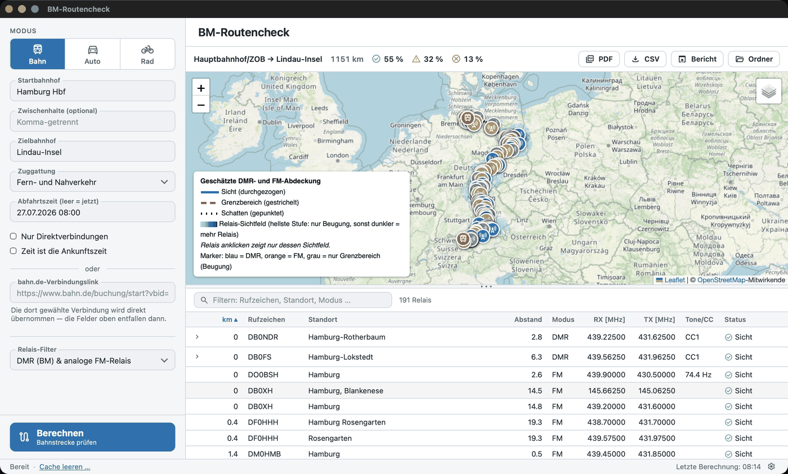
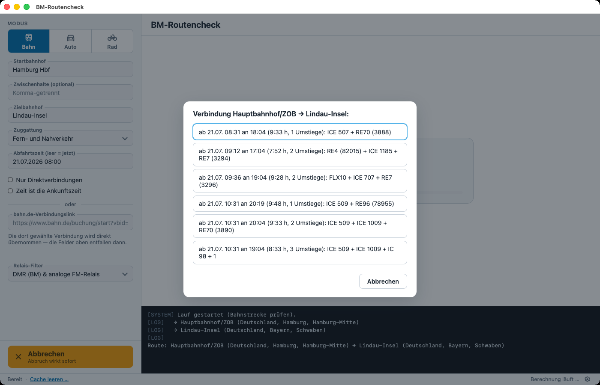
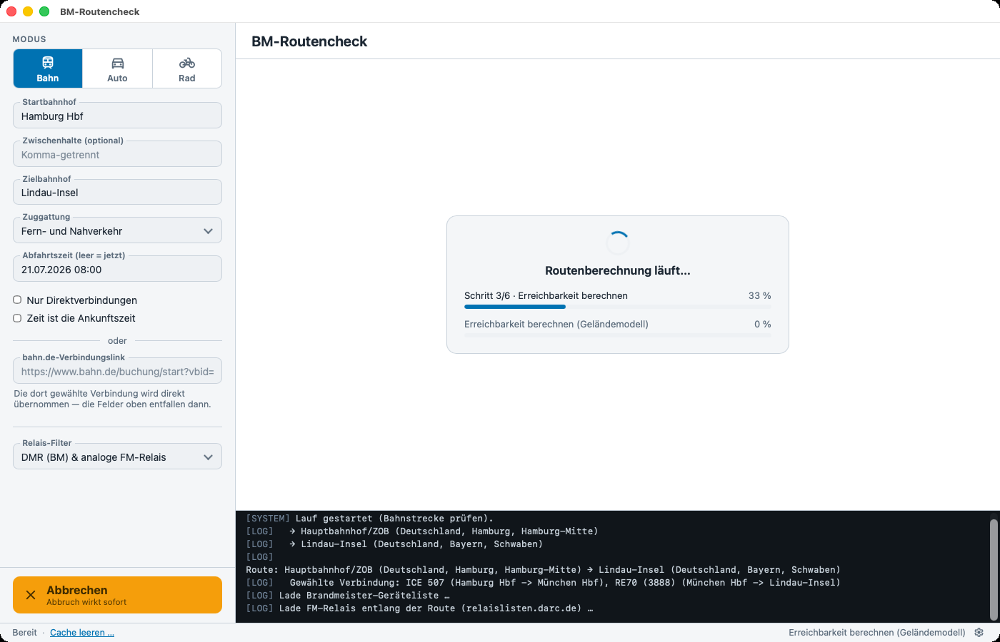
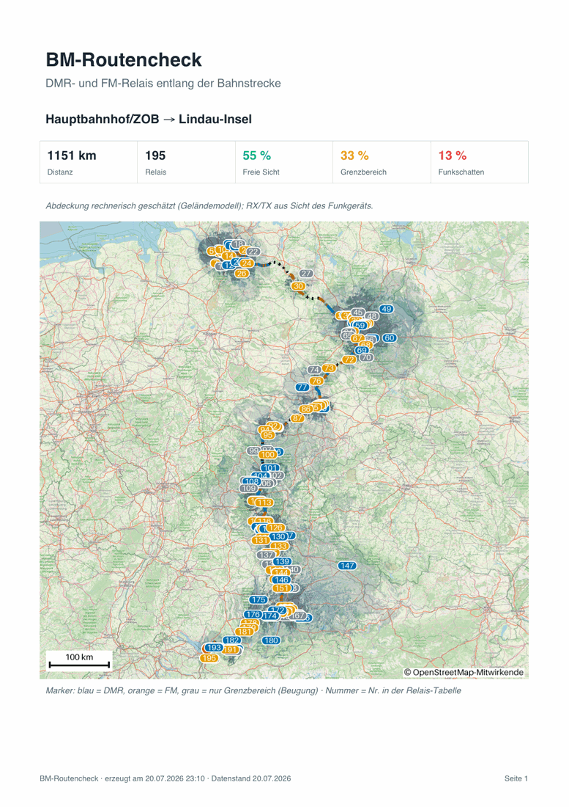

# BM-Routencheck

Welche Amateurfunk-Relais erreichst du unterwegs? BM-Routencheck ermittelt
für eine Route — per Bahn, Auto oder Fahrrad — alle rechnerisch erreichbaren
DMR-Relais des [Brandmeister-Netzwerks](https://brandmeister.network) und
analogen FM-Relais aus der
[DL3EL-Relaisliste](https://relaislisten.darc.de). Die Erreichbarkeit wird
pro Streckenpunkt über ein Sichtlinien-Geländemodell berechnet, nicht über
einen bloßen Entfernungsradius.

Jeder Lauf erzeugt einen HTML-Bericht mit fertigen Kanaltabellen je Relais,
eine interaktive Karte, eine CSV-Datei, fertige Codeplug-Dateien für
AnyTone-CPS und [CHIRP](https://chirpmyradio.com) und auf Wunsch einen
druckfertigen PDF-Bericht. Bedient wird wahlweise über das Programmfenster
(auf dem Desktop) oder vollwertig im Terminal — interaktiv per Menü oder
per Flags für Skripte.

<picture>
  <source media="(prefers-color-scheme: dark)" srcset="docs/fenster-dunkel.png">
  
</picture>

*Das Programmfenster nach einem Lauf Hamburg → Lindau: links die
Routing-Parameter, rechts Kennzahlen, Karte mit Route, Sichtfeldern und
Relais-Markern sowie die filterbare Relais-Tabelle. Helles und dunkles
Design, je nach System oder Wahl.*

## Inhalt

- [Download & Start](#download--start)
- [Bedienung](#bedienung)
- [Die Ergebnis-Dateien](#die-ergebnis-dateien)
- [Die Tools im Detail](#die-tools-im-detail)
- [Gemeinsame Parameter (alle Tools)](#gemeinsame-parameter-alle-tools)
- [Zwischenspeicher (Cache)](#zwischenspeicher-cache)
- [Installation aus dem Quellcode](#installation-aus-dem-quellcode)
- [Für Entwickler](#für-entwickler)

## Download & Start

Fertige Programme für Windows, Linux und macOS gibt es auf der
[**Releases-Seite**](https://github.com/DH1NOC/bm-routencheck/releases) —
Datei für das eigene Betriebssystem herunterladen und starten. Ein
installiertes Python ist **nicht** nötig. BM-Routencheck ist eine
Desktop-App: Der Doppelklick öffnet das Programmfenster; die vollwertige
Terminal-Bedienung bleibt erhalten und ist je Plattform unten beschrieben.

**Windows (x64):** Die `BM-Routencheck-…-windows-x64.exe` herunterladen
und doppelklicken — das Programmfenster öffnet sich, ohne dass ein
Konsolenfenster aufgeht. SmartScreen meldet
beim ersten Start „Unbekannter Herausgeber" —
über „Weitere Informationen" → „Trotzdem ausführen" geht es weiter (die
`.exe` ist nicht code-signiert; Microsofts Signaturdienst steht
Einzelentwicklern in Deutschland nicht offen). Auf Rechnern mit aktivem
**Smart App Control** (nur bei neu aufgesetztem Windows 11) wird die Datei
ohne Ausnahmemöglichkeit blockiert — dann SAC deaktivieren
(Windows-Sicherheit → App- & Browsersteuerung) oder die
[Installation aus dem Quellcode](#installation-aus-dem-quellcode) nutzen.

*Terminal unter Windows:* Dieselbe Exe versteht alle Kommandos, z. B.
`BM-Routencheck.exe bahn --help` in cmd oder PowerShell. Bauartbedingt
kehrt der Prompt dabei sofort zurück und die Ausgabe erscheint darunter —
die GUI-Exe klinkt sich in das aufrufende Konsolenfenster ein. Für
interaktive Terminal-Sitzungen `BM-Routencheck.exe --terminal` starten:
Das Menü öffnet sich in einem eigenen Konsolenfenster (das interaktive
Menü und PowerShell würden sich sonst dieselbe Konsole teilen).

**macOS (Apple Silicon):** Das ZIP herunterladen und entpacken,
`BM-Routencheck.app` in den Ordner *Programme* ziehen und per Doppelklick
starten. Die App ist mit Developer ID signiert, von Apple notarisiert und
das Ticket ist angeheftet — es ist keine Gatekeeper-Ausnahme nötig.

Für **Macs mit Intel-Prozessor** gibt es bewusst kein fertiges Programm —
ein Build, der nie auf echter Hardware getestet wurde, wird hier nicht
ausgeliefert. Auf diesen Geräten funktioniert die
[Installation aus dem Quellcode](#installation-aus-dem-quellcode) mit
vollem Funktionsumfang.

*Terminal unter macOS:* Das Binary im Bundle versteht alle Kommandos:

```bash
/Applications/BM-Routencheck.app/Contents/MacOS/BM-Routencheck bahn --help

# Tipp für häufige Nutzung — Alias in ~/.zshrc:
alias bmtools='/Applications/BM-Routencheck.app/Contents/MacOS/BM-Routencheck'
```

**Linux (x64):**

```bash
tar -xzf bmtools-*-linux-x64.tar.gz
./bmtools
```

Ohne Argumente öffnet sich auf einem Desktop das Programmfenster — das
Binary bringt sein GUI-Backend (Qt) mit, es müssen keine Systempakete
installiert werden. Im Terminal-Alltag funktionieren alle Kommandos wie
gewohnt (`./bmtools bahn --help`). Für einen Startmenü-Eintrag mit
Programm-Icon liegt eine `BM-Routencheck.desktop`-Vorlage bei (Pfade
anpassen, nach `~/.local/share/applications/` kopieren — siehe
LIESMICH.txt im Archiv).

## Bedienung

### Das Programmfenster (Desktop)

Auf einem Desktop öffnet `bmtools` ohne Argumente das Programmfenster:
links die Routing-Parameter, rechts Karte und Relais-Tabelle. Alle
Eingabewege des Terminals stehen auch hier zur Verfügung — Bahn per
bahn.de-Link oder Bahnhöfe/Zuggattung/Zeit, Auto/Rad per
Google-Maps-/Komoot-Link, GPX-Datei oder Start/Ziel. Parameter ändern und
direkt neu berechnen, ohne Bildschirmwechsel; während der Berechnung
zeigen Fortschrittsbalken und eine Log-Konsole den Stand, Abbrechen wirkt
sofort. Rückfragen (mehrdeutige Orte, Verbindungswahl) erscheinen als
Auswahl-Dialoge.

|  |  |
|---|---|
| *Rückfragen als Ein-Klick-Dialog: die Verbindungswahl bei `Bahn`* | *Während der Berechnung: Fortschritt oben, Log-Konsole unten* |

Nach dem Lauf zeigt das Fenster:

- die **interaktive Karte** (Route nach Erreichbarkeit gezeichnet,
  Sichtfeld-Overlay, Relais-Marker) — Klick auf einen Marker springt zur
  Tabellenzeile und umgekehrt;
- die **Relais-Tabelle**, live filterbar und sortierbar; DMR-Zeilen
  klappen die Talkgroup-Details auf;
- die Aktionen **CSV-Export**, **PDF-Export** (`bericht.pdf`), **Bericht
  im Browser öffnen** und **Ausgabeordner öffnen**.

`--terminal` erzwingt das Terminal, `--gui` das Fenster (hinter dem
Toolnamen, z. B. `bmtools bahn --gui`); ohne Desktop (SSH, Server)
startet automatisch das Terminal. Auch `bm-bahn`/`bm-auto`/`bm-rad`
öffnen ohne Routen-Argumente das Fenster mit dem jeweiligen Tool. Das
Linux-Binary bringt sein GUI-Backend (Qt) mit; nur bei der
[Installation aus dem Quellcode](#installation-aus-dem-quellcode)
braucht das Fenster GTK/WebKit2 oder QtWebEngine — fehlt beides, geht
es mit Hinweis im Terminal weiter.

### Das Terminal

Im Terminal startet ohne Argumente das Menü — alle Eingaben werden
interaktiv abgefragt (Auswahllisten mit ↑/↓ navigieren, Enter bestätigt,
Strg-C bricht ab):

```text
📡 BM-Routencheck
🚆  bahn  Bahnstrecke — Zugverbindung wählen, Relais entlang der Fahrt
🚗  auto  Autoroute — Google-Maps-Link einfügen oder Start/Ziel eingeben
🚴  rad   Radroute — Google-Maps-/Komoot-Link, GPX-Datei oder Start/Ziel
🧹  Cache leeren — gespeicherte API-Antworten und Höhenkacheln löschen
🚪  Beenden
```

Längere Schritte (Relais-Abfrage, Erreichbarkeits-Berechnung, Karte) zeigen
einen Fortschrittsbalken; ab etwa 10 Sekunden Restzeit erscheint zusätzlich
eine Zeitschätzung.

Für Skripte und Wiederholläufe laufen alle Tools auch nicht-interaktiv mit
Flags durch — jedes Tool zeigt mit `--help` seine vollständige Optionsliste
samt Beispielen. Für jedes deutsche Flag existiert das englische Original
als Alias (`--von` = `--from`, `--zeit` = `--time`, …):

```bash
bmtools bahn --von "Koblenz Hbf" --nach "Nürnberg Hbf" --oeffnen
bmtools auto "https://maps.app.goo.gl/…"
bmtools rad  --gpx tour.gpx
```

Bei der Installation aus dem Quellcode heißen die Tools zusätzlich
`bm-bahn`, `bm-auto` und `bm-rad`; die englischen Subcommand-Namen `rail`,
`car`, `bike` funktionieren ebenfalls.

## Die Ergebnis-Dateien

Jeder Lauf legt seine Ausgaben in `out/<start>-<ziel>/` ab (änderbar mit
`--ausgabe`). Im Terminal liegt `out/` im aktuellen Arbeitsverzeichnis;
beim Start per Doppelklick (Finder/Explorer) wechselt die App in den
Ordner `Dokumente/BM-Routencheck` und legt `out/` dort an. Der Knopf
**Ausgabeordner öffnen** im Programmfenster führt immer direkt hin.

| Datei | Inhalt |
|---|---|
| `bericht.html` | Bericht mit fertigen Kanaltabellen je Relais (für manuelle CPS-Eingabe) |
| `karte.html` | Interaktive Karte: Strecke + erreichbare Relais (blau = DMR, orange = FM) |
| `bericht.pdf` | Druckbericht DIN A4: Deckblatt mit Übersichtskarte und Kennzahlen, Relais-Tabelle mit Talkgroup-Details — nur mit `--pdf` bzw. per PDF-Export-Knopf im Fenster |
| `relais.csv` | Alle Daten maschinenlesbar (Semikolon-getrennt; Spalten `modus`, `ctcss_hz` für FM) |
| `anytone/*.CSV` | Channel/TalkGroups/Zone für den AnyTone-CPS-Import — digitale und analoge Kanäle in einer Zone |
| `chirp.csv` | Nur die FM-Kanäle im generischen [CHIRP](https://chirpmyradio.com)-CSV-Format — in CHIRP öffnen und auf jedes unterstützte Gerät laden (entfällt bei `--modus dmr`) |

Frequenzangaben in allen Ausgaben sind aus Sicht des Funkgeräts
(RX = Relais-Ausgabe) — auch bei FM. Berücksichtigt werden nur 2-m- und
70-cm-Relais (10 m/6 m/23 cm werden aussortiert). TG9 „Lokal" wird immer
ergänzt, auch wenn die API sie nicht listet. Der AnyTone-Export nutzt
derzeit das D878UV-Spaltenlayout.


*Die interaktive Karte (`karte.html`) im Browser: Die Strecke ist nach
Erreichbarkeit gezeichnet (durchgezogen = Sicht, gestrichelt =
Grenzbereich, gepunktet = Schatten), die blauen Flächen sind die
berechneten Sichtfelder der erreichbaren Relais — je dunkler, desto mehr
Relais.*



*Der Druckbericht (`bericht.pdf`, DIN A4): Deckblatt mit Kennzahlen und
Übersichtskarte, danach die Relais-Tabelle mit Talkgroup-Details —
nummerierte Marker verweisen auf die Tabellenzeilen.*

## Die Tools im Detail

### `bm-bahn` — Relais entlang einer Bahnstrecke

Sucht über [Transitous](https://transitous.org) eine reale Zugverbindung
zwischen Start- und Zielbahnhof und wertet deren Streckengeometrie aus.
Die Zuggattung beeinflusst die Route real: Hamburg–München fährt der
Fernverkehr z. B. via Erfurt oder via Würzburg, der Nahverkehr eine ganz
andere Kette — entsprechend ändern sich die gefundenen Relais.

**Streckenwahl** — bahn.de-Link, `--von`/`--nach` oder `--bahnhoefe`:

| Parameter | Bedeutung |
|---|---|
| `LINK` | bahn.de-Verbindungslink (`…?vbid=…`, der Teilen-Link einer gesuchten/gebuchten Verbindung) — übernimmt genau die dort gewählten Züge, die Verbindungsfilter unten entfallen |
| `--von BAHNHOF --nach BAHNHOF` | Start- und Zielbahnhof, z. B. `"Koblenz Hbf"` |
| `--via BAHNHOF` | Zwischenhalt zu `--von`/`--nach`; mehrfach angebbar (`--via Mainz --via Würzburg`) |
| `--bahnhoefe "A, B, C"` | Alternativ: kommagetrennte Bahnhofsliste statt `--von`/`--nach` |

bahn.de-Links laufen serverseitig nach einiger Zeit ab — dann auf bahn.de
neu suchen und frisch teilen.

**Verbindungsauswahl:**

| Parameter | Bedeutung |
|---|---|
| `--zuggattung {alle,fern,nah}` | `fern` = ICE/IC/EC und Nachtzüge, `nah` = RE/RB/S-Bahn (Default: `alle`) |
| `--zeit ZEIT` | Abfahrtszeit; Formate `"2026-07-14 08:00"`, `"14.07.2026 08:00"` oder `"08:00"` (= heute). Default: jetzt |
| `--ankunft` | `--zeit` als Ankunfts- statt Abfahrtszeit interpretieren |
| `--direkt` | Nur Direktverbindungen (ohne Umstieg) |
| `--luftlinie` | Keine Verbindungssuche; Luftlinie zwischen den Bahnhöfen auswerten |

Interaktiv wird bei mehrdeutigen Bahnhofsnamen immer nachgefragt („Koblenz"
ist z. B. auch exakt der Name eines Schweizer Bahnhofs) und unter mehreren
gefundenen Verbindungen ausgewählt. Nicht-interaktiv nimmt das Tool jeweils
den ersten Treffer bzw. die erste passende Verbindung.

```bash
bm-bahn "https://www.bahn.de/buchung/start?vbid=…" --oeffnen
bm-bahn --von "Koblenz Hbf" --nach "Nürnberg Hbf" --oeffnen
bm-bahn --von Hamburg --nach München --zuggattung fern --direkt
bm-bahn --von Koblenz --nach Nürnberg --zeit "2026-07-14 17:30" --ankunft
bm-bahn --bahnhoefe "Koblenz Hbf, Mainz Hbf, Würzburg Hbf" --luftlinie
```

### `bm-auto` / `bm-rad` — Relais entlang einer Auto- oder Radroute

Gleiche Auswertung und gleiche Ausgaben wie `bm-bahn`, aber für Straße und
Rad. Die Route kommt aus genau einer der drei Quellen — Link, GPX-Datei
oder Start/Ziel:

| Parameter | Bedeutung |
|---|---|
| `LINK` (Positionsargument) | Google-Maps-Routenlink (auch Kurzlink vom Teilen-Button) oder Komoot-Tour-Link |
| `--gpx DATEI` | GPX-Datei, z. B. ein Komoot-Export — funktioniert immer |
| `--von ORT --nach ORT` | Start/Ziel als Ort oder Adresse (hausnummerngenau) |
| `--via ORT` | Zwischenpunkt zu `--von`/`--nach`; mehrfach angebbar |

Was bei den Link-Quellen zu wissen ist:

- **Ein Google-Maps-Link enthält keine Routen-Geometrie**, nur die
  Wegpunkte. Das Tool routet daher selbst (OSRM auf
  OpenStreetMap-Daten) — der Verlauf kann von Googles Vorschlag leicht
  abweichen. Per Maus verschobene Routenpunkte stehen als Via-Punkte im
  Link und werden übernommen.
- **Ein Komoot-Link ist der bessere Fall:** Er zeigt auf eine gespeicherte
  Tour, deren exakte Geometrie übernommen wird — kein Nachrouten. Private
  Touren brauchen den „Mit Link teilen"-Link (enthält den nötigen
  `share_token`); klappt der Abruf nicht, ist der GPX-Export der Tour der
  garantierte Weg (`--gpx`).
- ÖPNV-Links lehnt das Tool ab und verweist auf `bm-bahn`.
- Widerspricht das Verkehrsmittel im Link dem Tool (Rad-Link in
  `bm-auto`), wird interaktiv nachgefragt; in Skripten gewinnt der Link.

```bash
bm-auto "https://maps.app.goo.gl/…"
bm-rad  "https://www.komoot.com/tour/…?share_token=…"
bm-rad  --gpx tour.gpx
bm-auto --von "Winkelhaider Str. 4a, Feucht" --nach "Bendorf" --oeffnen
```

## Gemeinsame Parameter (alle Tools)

| Parameter | Bedeutung |
|---|---|
| `--modus {dmr,fm,beide}` | Welche Relais ausgewertet werden: `dmr` = nur Brandmeister-DMR, `fm` = nur analoge FM-Relais, `beide` = gemeinsam in Bericht/Karte/CSV (Default: `beide`) |
| `--bandbreite {12.5,25}` | Bandbreite analoger FM-Kanäle im Codeplug in kHz (Default: `12.5`; das Kanalraster steht nicht in den DL3EL-Daten, daher keine Automatik) |
| `--ctcss-decode` | CTCSS auch als Empfangston setzen (Squelch öffnet nur beim Relais-Ton). Default: Empfang offen. Der Sendeton (Pilotton) wird unabhängig davon **immer** gesetzt, wenn die Quelle ihn nennt — viele FM-Relais öffnen nur damit |
| `--korridor KM` | Optionales Limit: maximaler Abstand zur Strecke in km. Ohne Angabe zählt allein die rechnerische Erreichbarkeit — auch weit entfernte, aber sichtbare Relais werden aufgenommen |
| `--ohne-gelaende` | Abdeckungsschätzung ohne Geländemodell; spart den Höhenkachel-Download, ist aber ungenauer |
| `--aktualisieren` | Relais-Daten frisch laden statt aus dem Cache (BM-Geräteliste und FM-Liste halten sonst 1 Tag, Talkgroup-Profile 12 h) |
| `--pdf` | Zusätzlich `bericht.pdf` erzeugen (Deckblatt mit Übersichtskarte, Relais-Tabelle mit Talkgroups) |
| `--oeffnen` | Bericht und Karte nach dem Lauf im Browser öffnen (interaktiv automatisch aktiv) |
| `--gui` / `--terminal` | Programmfenster bzw. Terminal erzwingen — Standard: ohne Routen-Argumente öffnet sich auf dem Desktop das Fenster |
| `--ausgabe ORDNER` | Ausgabeverzeichnis (Default: `out/<start>-<ziel>`) |

Alle genutzten Dienste sind ohne Anmeldung nutzbar — keine API-Keys, keine
Konfigurationsdatei.

## Zwischenspeicher (Cache)

Alle API-Antworten und Höhenkacheln landen in einem lokalen Disk-Cache;
Wiederholläufe brauchen dadurch nur Sekunden. Der Cache verwaltet sich
selbst (Relais-Daten verfallen nach spätestens einem Tag, `--aktualisieren`
erzwingt frische Daten) — er kann aber jederzeit komplett geleert werden,
etwa um Speicherplatz freizugeben:

- **Im Menü:** `🧹 Cache leeren` — zeigt erst, wie viel Speicher die
  Bereiche (Brandmeister-API, FM-Relaisliste, Höhenkacheln) belegen, und
  fragt vor dem Löschen nach.
- **Auf der Kommandozeile:** `bmtools cache` zeigt die Übersicht,
  `bmtools cache --leeren` löscht ohne Rückfrage.

Der nächste Lauf lädt gelöschte Daten automatisch neu herunter.

## Installation aus dem Quellcode

Alternative zu den fertigen Programmen — nötig sind **Python ≥ 3.12** und
**Git**:

```bash
git clone https://github.com/DH1NOC/bm-routencheck.git
cd bm-routencheck

python3 -m venv .venv            # Windows: py -m venv .venv
source .venv/bin/activate        # Windows PowerShell: .venv\Scripts\Activate.ps1
pip install -e .

bmtools                          # Menü aller Tools
```

Die Aktivierung der virtuellen Umgebung gilt pro Terminal-Sitzung; nach dem
Öffnen eines neuen Terminals im Projektordner erneut aktivieren. Wie eine
passende Python-Version installiert wird, steht in der
[Python-Dokumentation](https://www.python.org/downloads/) (Windows: bei der
Installation **„Add python.exe to PATH"** anhaken).

## Für Entwickler

Architektur, Qualitätssicherung, Projektstruktur, die Eigenheiten der
externen Datenquellen und der Release-Prozess sind im
[**Entwickler-README (DEVELOPER.md)**](DEVELOPER.md) beschrieben; offene
Punkte und verbindliche Festlegungen stehen in
[`PROJEKTPLAN.md`](PROJEKTPLAN.md).

## Lizenz

Siehe [LICENSE](LICENSE).
