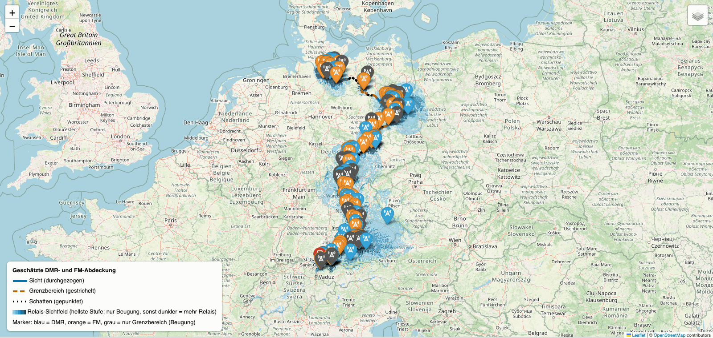

# BM-Routencheck

Kommandozeilen-Tools, die ermitteln, welche Amateurfunk-Relais entlang einer
Route erreichbar sind — per Bahn, Auto oder Fahrrad: DMR-Relais des
[Brandmeister-Netzwerks](https://brandmeister.network) und analoge FM-Relais
aus der [DL3EL-Relaisliste](https://relaislisten.darc.de) (umschaltbar per
`--modus`, Default: beide). Die Erreichbarkeit wird pro Streckenpunkt über
ein Sichtlinien-Geländemodell berechnet, nicht über einen bloßen
Entfernungsradius.

Drei Tools, ein gemeinsamer Kern:

| Kommando | Route aus |
|---|---|
| `bm-bahn` | Zugverbindung (bahn.de-Link oder Start-/Zielbahnhof, via [Transitous](https://transitous.org)) |
| `bm-auto` | Google-Maps-Link oder Start-/Zieladresse (OSRM-Routing) |
| `bm-rad` | Komoot-Tour, Google-Maps-Link, GPX-Datei oder Start/Ziel |

Jeder Lauf erzeugt in `out/<route>/` einen HTML-Bericht mit Kanaltabellen je
Relais (Rufzeichen, Frequenzen; bei DMR Colorcode und Talkgroups in TS1/TS2,
bei FM CTCSS und Ablage), eine interaktive Karte, eine CSV-Datei, einen
AnyTone-Codeplug-Export mit gemischter Zone und — sobald FM-Relais dabei
sind — ein CHIRP-CSV der analogen Kanäle.



*Die interaktive Karte (`karte.html`) eines `bm-auto`-Laufs: Die Strecke ist
nach Erreichbarkeit gezeichnet (durchgezogen = Sicht, gestrichelt =
Grenzbereich, gepunktet = Schatten), die blauen Flächen sind die berechneten
Sichtfelder der erreichbaren Relais — je dunkler, desto mehr Relais.*

Paketdefinition und Entry Points stehen in [`pyproject.toml`](pyproject.toml);
offene Punkte, verbindliche Festlegungen und die Eigenheiten der externen
Datenquellen in [`PROJEKTPLAN.md`](PROJEKTPLAN.md).

## Inhalt

- [Quick Start](#quick-start)
  - [Voraussetzungen](#voraussetzungen)
  - [Installation](#installation)
  - [Starten](#starten)
  - [Qualitätssicherung (Entwicklung)](#qualitätssicherung-entwicklung)
- [Die Tools im Detail](#die-tools-im-detail)
  - [`bmtools` — gemeinsamer Einstieg](#bmtools--gemeinsamer-einstieg)
  - [`bm-bahn` — Relais entlang einer Bahnstrecke](#bm-bahn--relais-entlang-einer-bahnstrecke)
  - [`bm-auto` / `bm-rad` — Relais entlang einer Auto- oder Radroute](#bm-auto--bm-rad--relais-entlang-einer-auto--oder-radroute)
  - [Gemeinsame Parameter (alle Tools)](#gemeinsame-parameter-alle-tools)
- [Technische Highlights & Externe Technologien](#technische-highlights--externe-technologien)
- [Projektstruktur](#projektstruktur)

## Quick Start

### Voraussetzungen

- **Python ≥ 3.12**
- **Git**
- Keine API-Keys, keine `.env`-Datei — alle genutzten Dienste sind ohne
  Anmeldung lesbar.

Prüfen, ob eine passende Python-Version vorhanden ist:

```bash
python3 --version        # Windows: py --version
```

Zeigt der Befehl 3.12 oder neuer, weiter zu [Installation](#installation).
Andernfalls Python wie folgt installieren:

**macOS** — über [Homebrew](https://brew.sh/) oder den Installer von
[python.org](https://www.python.org/downloads/macos/):

```bash
brew install python
```

**Linux** — über den Paketmanager der Distribution:

```bash
# Debian/Ubuntu
sudo apt install python3 python3-venv python3-pip

# Fedora
sudo dnf install python3
```

Liefert die Distribution ein älteres Python als 3.12, den Installer von
[python.org](https://www.python.org/downloads/) verwenden.

**Windows** — über [winget](https://learn.microsoft.com/windows/package-manager/winget/)
oder den Installer von [python.org](https://www.python.org/downloads/windows/)
(dort die Option **„Add python.exe to PATH"** anhaken):

```powershell
winget install Python.Python.3.12
```

### Installation

```bash
git clone https://github.com/DH1NOC/bm-routencheck.git
cd bm-routencheck

# Virtuelle Umgebung anlegen
python3 -m venv .venv            # Windows: py -m venv .venv

# Virtuelle Umgebung aktivieren
source .venv/bin/activate        # macOS/Linux
.venv\Scripts\Activate.ps1       # Windows PowerShell
.venv\Scripts\activate.bat       # Windows cmd

# Paket samt Abhängigkeiten installieren (editierbar)
pip install -e .
```

Die Aktivierung gilt pro Terminal-Sitzung; nach dem Öffnen eines neuen
Terminals im Projektordner erneut aktivieren.

### Starten

Der einfachste Weg ist der interaktive Modus — ohne Argumente starten, alle
Eingaben werden abgefragt (Auswahllisten mit ↑/↓ navigieren, Enter bestätigt):

```bash
bmtools            # Menü aller Tools
bm-bahn            # direkt: Relais entlang einer Bahnstrecke
```

Für Skripte und Wiederholläufe gibt es Flags — alle Parameter sind unter
[Die Tools im Detail](#die-tools-im-detail) dokumentiert:

```bash
bm-bahn --von "Koblenz Hbf" --nach "Nürnberg Hbf" --oeffnen
bm-auto "https://maps.app.goo.gl/…"
bm-rad  --gpx tour.gpx
```

Ergebnis pro Lauf in `out/<start>-<ziel>/`:

| Datei | Inhalt |
|---|---|
| `bericht.html` | Bericht mit fertigen Kanaltabellen je Relais (für manuelle CPS-Eingabe) |
| `relais.csv` | Alle Daten maschinenlesbar (Semikolon-getrennt; Spalten `modus`, `ctcss_hz` für FM) |
| `karte.html` | Interaktive Karte: Strecke + erreichbare Relais (blau = DMR, orange = FM) |
| `anytone/*.CSV` | Channel/TalkGroups/Zone für den AnyTone-CPS-Import — digitale und analoge Kanäle in einer Zone |
| `chirp.csv` | Nur die FM-Kanäle im generischen [CHIRP](https://chirpmyradio.com)-CSV-Format — in CHIRP öffnen und auf jedes unterstützte Gerät laden (entfällt bei `--modus dmr`) |

Der AnyTone-Export nutzt derzeit das D878UV-Spaltenlayout (siehe
[`PROJEKTPLAN.md`](PROJEKTPLAN.md), M5).

Alle API-Antworten und Höhenkacheln landen in einem lokalen Disk-Cache;
Wiederholläufe brauchen dadurch nur Sekunden. `--aktualisieren` erzwingt
frische Relais-Daten.

### Qualitätssicherung (Entwicklung)

```bash
pip install -e ".[dev]"
make qs          # Lint (ruff) + Typprüfung (mypy strict) + Tests (pytest)
make abdeckung   # Tests mit HTML-Abdeckungsbericht (out/coverage/)
```

Dieselben Prüfungen laufen als GitHub-Actions-Workflow bei jedem Push
(`.github/workflows/qs.yml`). Konfiguriert ist alles in `pyproject.toml`:

- **ruff** — Lint inkl. Import-Sortierung, bugbear und Modernisierung;
  Ausnahmen (z. B. deutsche Typografie) sind dort begründet.
- **mypy strict** — der gesamte Quellcode ist streng typgeprüft; die
  wenigen Lockerungen (ungetypte Bibliotheken, Tests ohne
  Annotationszwang) sind als Overrides dokumentiert.
- **pytest + coverage** — getestet wird die Kernlogik (Parser, Geometrie,
  Abdeckungsschätzung, Berichte, Codeplug, API-Clients mit gemockten
  HTTP-Antworten). Interaktive CLIs und Karten-Rendering sind bewusst
  ausgenommen; die Untergrenze (`fail_under`) sichert das erreichte
  Niveau ab, ohne Statistik-Kosmetik zu belohnen.

## Die Tools im Detail

Alle Tools folgen demselben Muster: **Ohne Argumente startet ein
interaktiver Assistent**, der alle Angaben abfragt — mit Argumenten laufen
sie nicht-interaktiv durch (skriptfähig). Jedes Tool zeigt mit `--help`
seine vollständige Optionsliste samt Beispielen. Für jedes deutsche Flag
existiert das englische Original als Alias (`--von` = `--from`,
`--zeit` = `--time`, …).

### `bmtools` — gemeinsamer Einstieg

```bash
bmtools                  # Menü aller Tools (Pfeiltasten + Enter)
bmtools bahn [OPTIONEN]  # Tool direkt starten, Optionen werden durchgereicht
bmtools auto [OPTIONEN]
bmtools rad  [OPTIONEN]
```

`bmtools bahn --von Koblenz --nach Nürnberg` ist identisch zu
`bm-bahn --von Koblenz --nach Nürnberg`. Die englischen Subcommand-Namen
`rail`, `car`, `bike` funktionieren ebenfalls.

### `bm-bahn` — Relais entlang einer Bahnstrecke

Sucht über [Transitous](https://transitous.org) eine reale Zugverbindung
zwischen Start- und Zielbahnhof und wertet deren Streckengeometrie aus.
Die Zuggattung beeinflusst die Route real: Hamburg–München fährt der
Fernverkehr z. B. via Erfurt oder via Würzburg, der Nahverkehr eine ganz
andere Kette — entsprechend ändern sich die gefundenen Relais.

**Streckenwahl** — bahn.de-Link, `--von`/`--nach` oder `--bahnhoefe`:

| Parameter | Bedeutung |
|---|---|
| `LINK` | bahn.de-Verbindungslink (`…?vbid=…`, der Teilen-Link einer gesuchten/gebuchten Verbindung) — übernimmt genau die dort gewählten Züge, die Verbindungsfilter unten entfallen |
| `--von BAHNHOF --nach BAHNHOF` | Start- und Zielbahnhof, z. B. `"Koblenz Hbf"` |
| `--via BAHNHOF` | Zwischenhalt zu `--von`/`--nach`; mehrfach angebbar (`--via Mainz --via Würzburg`) |
| `--bahnhoefe "A, B, C"` | Alternativ: kommagetrennte Bahnhofsliste statt `--von`/`--nach` |

Der bahn.de-Link wird über einen inoffiziellen bahn.de-Endpunkt in die
einzelnen Fahrtabschnitte aufgelöst; die Streckengeometrie liefert danach
wie üblich Transitous (Abschnitte werden über die exakte Abfahrtszeit dem
Fahrplandatensatz zugeordnet). Solche Links laufen serverseitig nach
einiger Zeit ab — dann auf bahn.de neu suchen und frisch teilen.

**Verbindungsauswahl:**

| Parameter | Bedeutung |
|---|---|
| `--zuggattung {alle,fern,nah}` | `fern` = ICE/IC/EC und Nachtzüge, `nah` = RE/RB/S-Bahn (Default: `alle`) |
| `--zeit ZEIT` | Abfahrtszeit; Formate `"2026-07-14 08:00"`, `"14.07.2026 08:00"` oder `"08:00"` (= heute). Default: jetzt |
| `--ankunft` | `--zeit` als Ankunfts- statt Abfahrtszeit interpretieren |
| `--direkt` | Nur Direktverbindungen (ohne Umstieg) |
| `--luftlinie` | Keine Verbindungssuche; Luftlinie zwischen den Bahnhöfen auswerten |

Interaktiv wird bei mehrdeutigen Bahnhofsnamen immer nachgefragt
(„Koblenz" ist z. B. auch exakt der Name eines Schweizer Bahnhofs) und
unter mehreren gefundenen Verbindungen ausgewählt. Nicht-interaktiv nimmt
das Tool jeweils den ersten Treffer bzw. die erste passende Verbindung.

```bash
bm-bahn "https://www.bahn.de/buchung/start?vbid=…" --oeffnen
bm-bahn --von "Koblenz Hbf" --nach "Nürnberg Hbf" --oeffnen
bm-bahn --von Hamburg --nach München --zuggattung fern --direkt
bm-bahn --von Koblenz --nach Nürnberg --zeit "2026-07-14 17:30" --ankunft
bm-bahn --bahnhoefe "Koblenz Hbf, Mainz Hbf, Würzburg Hbf" --luftlinie
```

### `bm-auto` / `bm-rad` — Relais entlang einer Auto- oder Radroute

Gleiche Auswertung und gleiche Ausgaben wie `bm-bahn`, aber für Straße und
Rad. Die Route kommt aus genau einer der drei Quellen — Link, GPX-Datei
oder Start/Ziel:

| Parameter | Bedeutung |
|---|---|
| `LINK` (Positionsargument) | Google-Maps-Routenlink (auch Kurzlink vom Teilen-Button) oder Komoot-Tour-Link |
| `--gpx DATEI` | GPX-Datei, z. B. ein Komoot-Export — funktioniert immer |
| `--von ORT --nach ORT` | Start/Ziel als Ort oder Adresse (hausnummerngenau, Geocoding via Transitous) |
| `--via ORT` | Zwischenpunkt zu `--von`/`--nach`; mehrfach angebbar |

Was bei den Link-Quellen zu wissen ist:

- **Ein Google-Maps-Link enthält keine Routen-Geometrie**, nur die
  Wegpunkte. Das Tool routet daher selbst (OSRM auf
  OpenStreetMap-Daten) — der Verlauf kann von Googles Vorschlag leicht
  abweichen. Per Maus verschobene Routenpunkte stehen als Via-Punkte im
  Link und werden übernommen.
- **Ein Komoot-Link ist der bessere Fall:** Er zeigt auf eine gespeicherte
  Tour, deren exakte Geometrie übernommen wird — kein Nachrouten. Private
  Touren brauchen den „Mit Link teilen"-Link (enthält den nötigen
  `share_token`); klappt der Abruf nicht, ist der GPX-Export der Tour der
  garantierte Weg (`--gpx`).
- ÖPNV-Links lehnt das Tool ab und verweist auf `bm-bahn`.
- Widerspricht das Verkehrsmittel im Link dem Tool (Rad-Link in
  `bm-auto`), wird interaktiv nachgefragt; in Skripten gewinnt der Link.

```bash
bm-auto "https://maps.app.goo.gl/…"
bm-rad  "https://www.komoot.com/tour/…?share_token=…"
bm-rad  --gpx tour.gpx
bm-auto --von "Winkelhaider Str. 4a, Feucht" --nach "Bendorf" --oeffnen
```

### Gemeinsame Parameter (alle Tools)

| Parameter | Bedeutung |
|---|---|
| `--modus {dmr,fm,beide}` | Welche Relais ausgewertet werden: `dmr` = nur Brandmeister-DMR, `fm` = nur analoge FM-Relais, `beide` = gemeinsam in Bericht/Karte/CSV (Default: `beide`) |
| `--bandbreite {12.5,25}` | Bandbreite analoger FM-Kanäle im Codeplug in kHz (Default: `12.5`; das Kanalraster steht nicht in den DL3EL-Daten, daher keine Automatik) |
| `--ctcss-decode` | CTCSS auch als Empfangston setzen (Squelch öffnet nur beim Relais-Ton). Default: Empfang offen, der Ton wird nur gesendet |
| `--korridor KM` | Optionales Limit: maximaler Abstand zur Strecke in km. Ohne Angabe zählt allein die rechnerische Erreichbarkeit — auch weit entfernte, aber sichtbare Relais werden aufgenommen |
| `--ohne-gelaende` | Abdeckungsschätzung ohne Geländemodell; spart den Höhenkachel-Download, ist aber ungenauer |
| `--aktualisieren` | Relais-Daten frisch laden statt aus dem Cache (BM-Geräteliste und FM-Liste halten sonst 1 Tag, Talkgroup-Profile 12 h) |
| `--oeffnen` | Bericht und Karte nach dem Lauf im Browser öffnen (interaktiv automatisch aktiv) |
| `--ausgabe ORDNER` | Ausgabeverzeichnis (Default: `out/<start>-<ziel>`) |

Frequenzangaben in allen Ausgaben sind aus Sicht des Funkgeräts
(RX = Relais-Ausgabe) — auch bei FM. TG9 „Lokal" wird immer ergänzt, auch
wenn die API sie nicht listet.

## Technische Highlights & Externe Technologien

**Kernbibliotheken** (siehe [`pyproject.toml`](pyproject.toml)):

- [httpx](https://www.python-httpx.org/) — HTTP-Client für alle API-Zugriffe
- [Rich](https://rich.readthedocs.io/) und
  [Questionary](https://questionary.readthedocs.io/) — Terminal-Ausgabe und
  interaktive Auswahlmenüs
- [Folium](https://python-visualization.github.io/folium/) — erzeugt die
  interaktive Karte auf Basis von [Leaflet](https://leafletjs.com/) und
  [OpenStreetMap](https://www.openstreetmap.org/)
- [NumPy](https://numpy.org/) und [Pillow](https://python-pillow.org/) —
  Geländemodell: Höhenraster dekodieren und Sichtlinien berechnen
- [platformdirs](https://platformdirs.readthedocs.io/) — plattformgerechter
  Ablageort für den Disk-Cache

**Externe Dienste** (alle ohne API-Key nutzbar):

- [Brandmeister-API v2](https://api.brandmeister.network/v2/) — DMR-Relais,
  Frequenzen, Talkgroup-Profile
- [DL3EL-Relaisliste](https://relaislisten.darc.de) — analoge FM-Relais
  (Frequenzen, CTCSS) per Umkreissuche entlang der Route
- [Transitous](https://transitous.org) — Bahnverbindungen inklusive
  Streckengeometrie
- [OSRM auf FOSSGIS-Servern](https://routing.openstreetmap.de) — Auto- und
  Radrouting auf OpenStreetMap-Daten
- [Komoot-API](https://www.komoot.com) — exakte Geometrie gespeicherter Touren
- [AWS Terrain Tiles](https://registry.opendata.aws/terrain-tiles/) —
  Höhendaten (Terrarium-Format) für das Sichtlinien-Modell

## Projektstruktur

```text
bm-routencheck/
├── bmtools/              # Python-Paket mit allen Tools
│   ├── bm_api/           # Brandmeister-API-Client (HTTP, Disk-Cache, Datenmodelle)
│   ├── fm_api/           # DL3EL-Client für analoge FM-Relais (Umkreissuche,
│   │                     #   defensiver CSV/GPX-Parser, Disk-Cache)
│   ├── routelib/         # Gemeinsamer Kern: Geländemodell/Erreichbarkeit,
│   │                     #   Bericht, Karte, CSV, Codeplug-Export, Pipeline
│   ├── rail/             # bm-bahn (Bahnverbindungen via Transitous)
│   ├── road/             # bm-auto / bm-rad (Maps-/Komoot-Link, GPX, OSRM, Geocoding)
│   ├── cli.py            # bmtools-Einstieg: Menü und Subcommand-Dispatcher
│   └── ui.py             # Gemeinsames CLI-Erscheinungsbild (Banner, Farben)
├── tests/                # pytest-Suite (Parser, Geometrie, Berichte, Clients)
├── out/                  # Generierte Berichte/Karten/CSV je Route (nicht versioniert)
├── pyproject.toml        # Paketdefinition, Abhängigkeiten, Entry Points
├── PROJEKTPLAN.md        # Offene Punkte, Festlegungen, API-Eigenheiten
└── README.md
```

- **`bmtools/bm_api/`** — wiederverwendbarer, gecachter Client für die
  Brandmeister-API; unabhängig von den Routen-Tools nutzbar.
- **`bmtools/fm_api/`** — Gegenstück für relaislisten.darc.de (DL3EL):
  Umkreisabfragen je Streckenraster, Parser für die „schmutzigen"
  CSV/GPX-Antworten, Dedupe über (Rufzeichen, Frequenz).
- **`bmtools/routelib/`** — die gesamte Auswertung von der Routen-Geometrie
  bis zu den Ausgabedateien; die Tools in `rail/` und `road/` liefern nur die
  Route an diese Pipeline.
